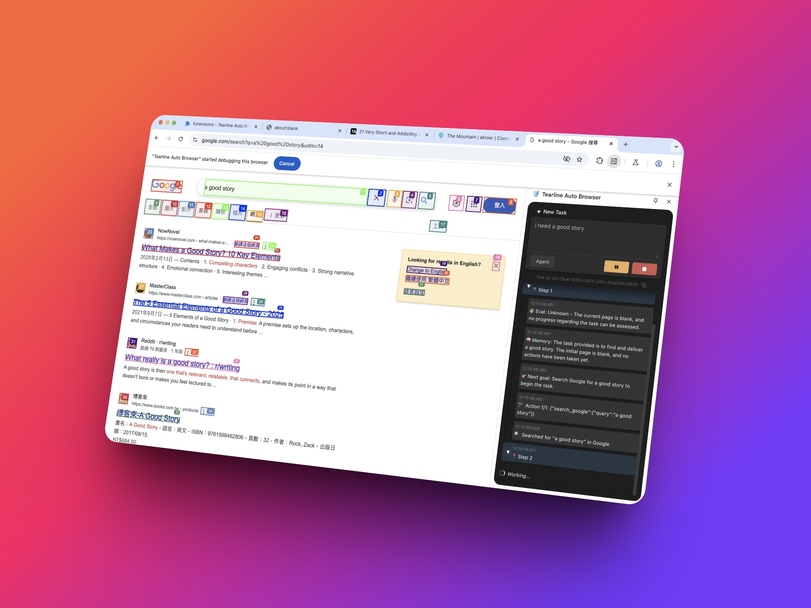

# GhostDriver



This project aims to enable users to describe tasks in natural language, which are then analyzed by AI to control the browser for automated execution.

## Development

### playwright-crx

This extension project depends on [ruifigueira/playwright-crx](https://github.com/ruifigueira/playwright-crx), which we have modified to support WebSocket communication with the backend. The modified code is currently closed-source and can be found at [tearline-xyz/playwright-crx](https://github.com/tearline-xyz/playwright-crx). During development, whether initializing the project or making further modifications to playwright-crx, execute the following command in the root directory of this project:

```bash
./auto/build-playwright-crx.sh
```

Additionally, if modifications are made to playwright-crx, ensure you are on the `tearline` branch, and do not forget to create a PR for this.

## [Publishing](https://wxt.dev/guide/essentials/publishing.html)

1. Update the `version` field in `package.json`.
2. Run `pnpm zip` to generate a zip file with the version number in the `dist` directory.

## Feature Toggle

### Share Feature

- `DEFAULT_INTERACTION_TOGGLE.shareButton`

### Developer Settings Page

- `WXT_GHOST_DRIVER_DEV_VERSION`

### `apiHost` in `DEFAULT_SETTINGS`

- `WXT_GHOST_DRIVER_DEV_VERSION`
